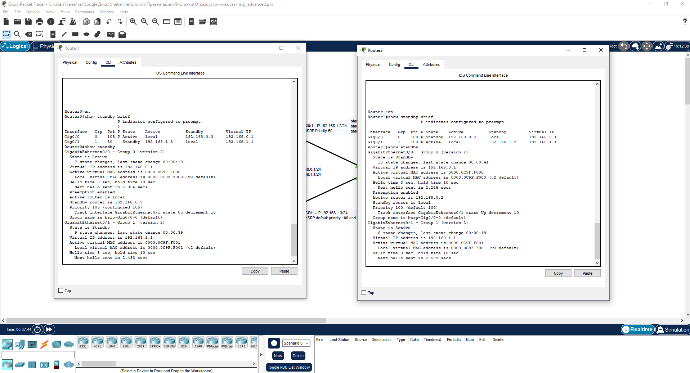
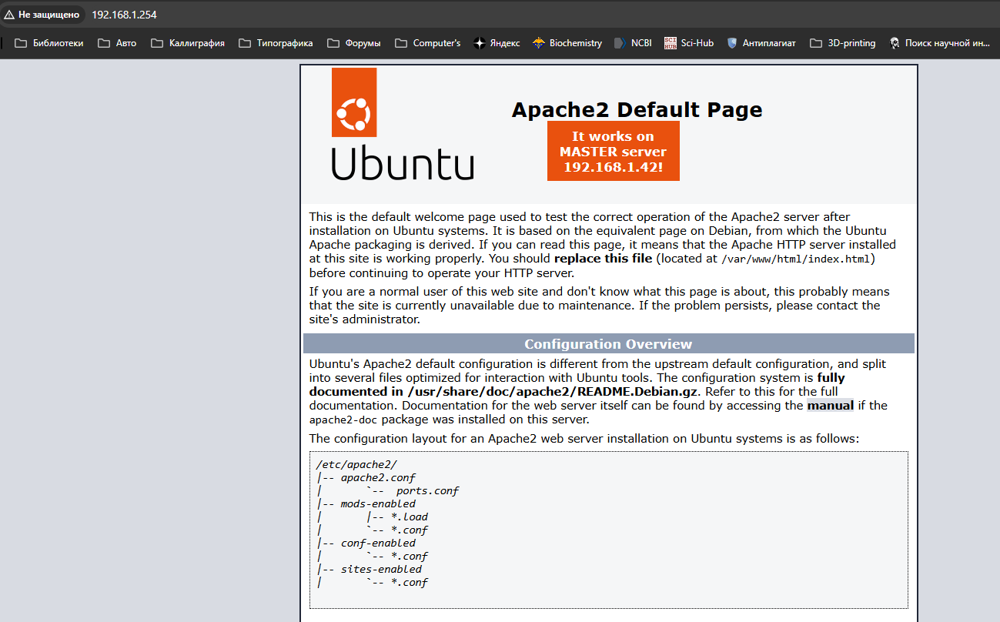
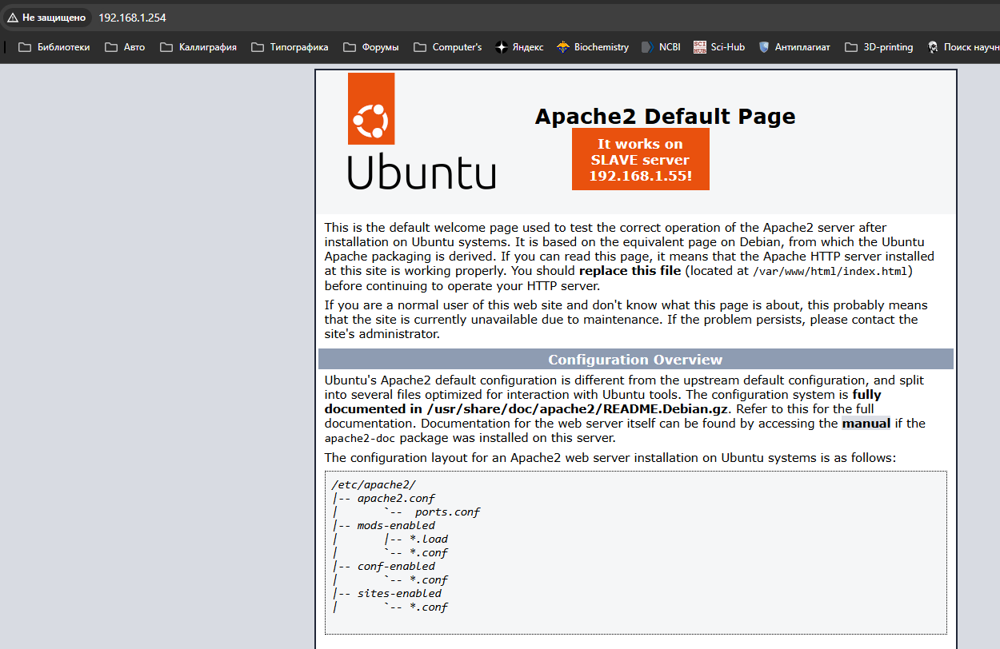

# Домашнее задание к занятию "Disaster recovery и Keepalived" - Сенотов А.С.

   
---

### Задание 1

1. Дана схема для Cisco Packet Tracer, рассматриваемая в лекции.
2. На данной схеме уже настроено отслеживание интерфейсов маршрутизаторов Gi0/1 (для нулевой группы)
3. Необходимо аналогично настроить отслеживание состояния интерфейсов Gi0/0 (для первой группы).
4. Для проверки корректности настройки, разорвите один из кабелей между одним из маршрутизаторов и Switch0 и запустите ping между PC0 и Server0.
5. На проверку отправьте получившуюся схему в формате pkt и скриншот, где виден процесс настройки маршрутизатора.
 
##### Проверка настроек. 



##### На роутере 1 полностью всё настроено, но не указано упреждение (preempt) интерфейсе g0/1. Добавляем preempt


---

### Задание 2

1. Запустите две виртуальные машины Linux, установите и настройте сервис Keepalived как в лекции, используя пример конфигурационного файла.
2. Настройте любой веб-сервер (например, nginx или simple python server) на двух виртуальных машинах
3. Напишите Bash-скрипт, который будет проверять доступность порта данного веб-сервера и существование файла index.html в root-директории данного веб-сервера.
4. Настройте Keepalived так, чтобы он запускал данный скрипт каждые 3 секунды и переносил виртуальный IP на другой сервер, если bash-скрипт завершался с кодом, отличным от нуля (то есть порт веб-сервера был недоступен или отсутствовал index.html). Используйте для этого секцию vrrp_script
5. На проверку отправьте получившейся bash-скрипт и конфигурационный файл keepalived, а также скриншот с демонстрацией переезда плавающего ip на другой сервер в случае недоступности порта или файла index.html

Для выполнения работы на машинах был установлен веб-сервер apache2 и keepalived.
Настройки keepalived для обеих машин на скриншоте ниже


``` Bash
#!/bin/bash
if [[ $(netstat -tunlp | grep LISTEN | grep :80) ]] && [[ -f /var/www/html/index.html ]]; then
        exit 0
else
        sudo systemctl stop keepalived
fi
```

После запуска keepalived и перехода по адресу виртуального сервера попадаем на страницу MASTER сервера (index.html изменена)



Выполняем команду
``` shell
sudo mv /var/www/html/index.html /var/www/html/index.html_stop
```
проверяем по адресу виртуального сервера и попадаем на страницу SLAVE сервера (index.html изменена)


